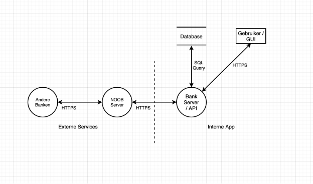

# Beveiligingsrapport – Project ¾ – Groep 1

Dennis Zejnilovic (1098617), Scott van der Heijden (1103349), Arda Keskin (1096673), Julius de Maesschalck (1101422)

Klas: 1-A

## Banque

Bij een bank is veiligheid erg belangrijk, in ons project maken wij een pinautomaat die 
online staat voor andere banken waarmee we kunnen communiceren. Zodat die communicatie zo 
veilig mogelijk is, moet onze bank goed beveiligd worden, de gegevens van klanten en de 
betrouwbaarheid van apparaten moeten daardoor goed geanalyseerd worden. Voor dit verslag 
hebben we de onderzoeksvraag: “Welke beveiligingsmaatregelen moeten genomen worden ter 
beveiliging van de bank?”. In dit verslag gaan we deze vraag beantwoorden na mate een Data 
Flow Diagram(DFD), een Risicoanalyse en maatregelen die we kunnen nemen. 

## Dataflow Diagram ( DFD )

## Attack trees

Hieronder is een attack tree weergegeven voor het verkrijgen van ongeautoriseerde toegang tot gebruikersgegevens in ons systeem.

#### Ongeautoriseerde toegang tot gebruikersgegevens

---

                    [Toegang tot gebruikersgegevens]
                            |
                +-------------+--------------+
                |                            |
        [Login gegevens stelen]       [Backend lek misbruiken]
                |                            |
    +--------+--------+         +---------+----------+
    |                 |         |                    |
    [Phishing]   [Keylogger]   [SQL-injectie]     [API-lek]

#### Manipuleren van transacties

---

                [Transacties manipuleren]
                            |
            +----------------+----------------+
            |                                 |
    [Ongeautoriseerde toegang]      [Systeemlogica misbruiken]
            |                                 |
        [Account hack]               [Bedragen manipuleren]
            |                                 |
    [Phishing / brute force]       [Client-side manipulatie]
                                            |
                                [Interceptie via devtools]

#### Data exfiltreren

---

                    [Data exfiltreren]
                            |
            +--------------+-------------+
            |                            |
    [Directe toegang]          [Indirect via applicatie]
            |                            |
    [Database dump via SQLi]      [Kwetsbare API gebruiken]
            |                            |
        [Toegang via exploit]     [Authenticatie omzeilen]

## Risicoanalyse

Om het systeem van onze zelfgebouwde bank veilig te houden, is het essentieel om inzicht 
te krijgen in mogelijke dreigingen en hoe deze uitgevoerd kunnen worden. In dit hoofdstuk 
worden drie risicogebieden onderzocht: aanvallen op de systemen van de bank, aanvallen op 
de verbindingen tussen banken, en fysieke aanvallen op de gebruikte hardware.

#### Bij aanvallen op de systemen binnen de bank zijn de belangrijkste risico’s:

---

- SQL-injection: Er kunnen via invoervelden kwaadaardige SQL-code worden gestuurd naar onze database, waardoor ze toegang kunnen krijgen tot of wijzigingen kunnen aanbrengen in de database (zoals Union-based SQLi). Hierdoor kunnen onbevoegde toegang krijgen tot klantgegevens of financiële informatie, of het verwijderen van gegevens.[4]
- Onbeveiligde API endpoints: De API kan aangevallen worden als deze geen goede authenticatie of autorisatie bevat. Onbevoegde toegang tot functies zoals geld overmaken of klantdata uitlezen.[3]

#### Aanvallen op de verbindingen tussen banken:

---

- Man-in-the-Middle (MitM) aanval: Een aanvaller onderschept of wijzigt de communicatie tussen banken. Gevoelige gegevens kunnen hierdoor worden gemanipuleerd.[1]

Fysieke aanvallen op gebruikte hardware:

- Backend RFID aanval: deze aanvallen gebruikt het geheugen van de RFID-chip om dingen te sturen zoals malware of zelfs SQL-injections, door het meegeven van malware kunnen gegevens van de gehele bank verwijdert worden.[2]
- Sabotage van bedrading en/of hardwarecomponenten: Een aanvaller krijgt toegang tot de binnekant van de behuizing van de pinautomaat en trekt draaden eruit, de aanvaller krijgt toegang tot de micro-controller en zet daar kwaadaardige code op. Hierdoor kan de pinautomaat defect raken en kunnen gegevens gestolen gestolen worden

#### Beveiligingsmaatregelen

---

Om de risico’s die we in de risicoanalyse hebben geïdentificeerd te minimaliseren of te 
elimineren, hebben we per risico passende beveiligingsmaatregelen geformuleerd. Deze 
maatregelen richten zich op drie aandachtsgebieden: systeembeveiliging binnen de bank, 
beveiliging van communicatie tussen banken en fysieke beveiliging van hardware. Elke 
maatregel wordt onderbouwd met praktische implementaties en bronnen waar van toepassing.

## Bescherming tegen aanvallen op systemen binnen de bank

#### SQL-Injection

---

Maatregel: Gebruik van parameterized queries of prepared statements.

Implementatie: Bij het programmeren van database interacties zorgen we ervoor dat alle SQL-queries gebruik maken van parameterbinding, waardoor gebruikersinput niet als uitvoerbare SQL wordt geïnterpreteerd.

Onderbouwing: Volgens OWASP is het gebruik van parameterized queries de meest effectieve manier om SQL-Injecties te voorkomen [5].

#### Onbeveiligde API endpoints

---

Maatregel: Implementatie van authenticatie en autorisatie via JWT (JSON Web Tokens).

Implementatie: Elke API-call vereist een geldige token. Zonder token wordt de toegang geweigerd. Gebruikers ontvangen alleen tokens na succesvolle logins.

Onderbouwing: Het gebruik van JWT is een industrie-standaard voor stateless authenticatie en wordt aangeraden door onder andere Auth0 en OWASP [6] en [7].

#### Aanvullende maatregelen

---

Regelmatige systeem-updates

Hiermee worden bekende kwetsbaarheden in het besturingssysteem en geïnstalleerde pakketten verholpen.

#### Fail2Ban

---

Hiermee worden brute-force aanvallen geblokkeerd.

#### SSH Hardening

---

Hiermee wordt root login uitgeschakeld en alleen SSH key-authenticatie wordt toegestaan.

## Bescherming van communicatie tussen banken**

#### Man-in-the-Middle (MitM)

---

Maatregel: Versleuteling van netwerkverkeer via TLS/SSL.

Implementatie: Alle communicatie tussen banken verloopt via HTTPS met een geldig TLS-certificaat. We maken gebruik van Let’s Encrypt om certificaten automatisch te genereren en te vernieuwen.

Onderbouwing: TLS is de standaardmethode voor het beschermen van dataverkeer tegen afluisteren en manipulatie [8].

#### Aanvullende maatregelen

---

Regelmatige security audits

Hiermee doen we periodiek penetratietests en netwerkanalyses, zoals is aangeraden door Datalab Rotterdam.

## Bescherming tegen fysieke aanvallen op hardware

#### Backend RFID Aanval

---

Maatregel: Strikte inputvalidatie op alle externe invoer, inclusief randapparatuur zoals RFID-lezers.

Implementatie: Elke binnenkomende waarde van externe hardware wordt geëvalueerd op type, formaat, lengte en verwachte inhoud vóór verwerking door het systeem. Hiermee voorkomen we dat onverwachte of kwaadaardige data invloed hebben op het systeem.

Onderbouwing: Inputvalidatie is een fundamenteel principe in beveiliging en wordt expliciet aanbevolen door OWASP om ongewenste systeeminteractie te voorkomen, inclusief bij hardware-interactie [9].

#### Aanvullende maatregelen

---

Uitschakelen van ongebruikte services

Hiermee verkleinen we het aanvalsoppervlak van het systeem.

## Sabotage van bedrading en/of hardwarecomponenten

Maatregel: Fysieke beveiliging van de behuizing.

Implementatie: De pinautomaat wordt voorzien van een stevige, afsluitbare behuizing en word meerdere keren getest.

## Conclusie

In dit project hebben we onderzocht welke beveiligingsmaatregelen noodzakelijk zijn om onze zelfgebouwde online bank en pinautomaat veilig te houden. Op basis van een risicoanalyse, gericht op systeemaanvallen, netwerkcommunicatie en fysieke hardware, hebben we doelgerichte maatregelen genomen. Door het gebruik van onder andere parameterized queries, versleutelde communicatie via TLS, JWT-authenticatie en fysieke beveiliging van de hardware beperken we de kans op datalekken, manipulatie en sabotage aanzienlijk. Deze maatregelen zorgen ervoor dat klantgegevens veilig blijven, de betrouwbaarheid van het systeem gewaarborgd is en communicatie met andere banken op een veilige manier verloopt. Hiermee verkleinen we actief het aanvalsoppervlak van ons systeem en verhogen we de veiligheid

## Bronvermelding

[1] Imperva, “Man-in-the-Middle (MitM) Attack,” *Imperva*, [Online]. Available: https://www.imperva.com/learn/application-security/man-in-the-middle-attack-mitm/. [Accessed: 22-May-2025].

[2] KPMG Netherlands, “An introduction to RFID security,” *KPMG Blogs*, Jul. 2023. [Online]. Available: https://kpmg.com/nl/nl/blogs/home/posts/2023/07/an-introduction-to-rfid-security.html. [Accessed: 22-May-2025].

[3] OWASP Foundation, “OWASP API Security Top 10,” *OWASP*, [Online]. Available: https://owasp.org/www-project-api-security/. [Accessed: 22-May-2025].

[4] Imperva, “SQL Injection (SQLi),” *Imperva*, [Online]. Available: https://www.imperva.com/learn/application-security/sql-injection-sqli/. [Accessed: 22-May-2025].

[5] OWASP Foundation, “SQL Injection Prevention Cheat Sheet,” *OWASP Cheat Sheet Series*, 2023. [Online]. Available: https://cheatsheetseries.owasp.org/cheatsheets/SQL\_Injection\_Prevention\_Cheat\_Sheet.html. [Accessed: 22-May-2025].

[6] OWASP Foundation, “Authentication Cheat Sheet,” *OWASP Cheat Sheet Series*. [Online]. Available: https://cheatsheetseries.owasp.org/cheatsheets/Authentication\_Cheat\_Sheet.html. [Accessed: 22-May-2025].

[7] Auth0, “JWT Handbook,” *Auth0 Documentation*. [Online]. Available: https://auth0.com/docs/secure/tokens/json-web-tokens. [Accessed: 22-May-2025].

[8] Mozilla, “Security/Server Side TLS,” *Mozilla Wiki*, Apr. 2024. [Online]. Available: https://wiki.mozilla.org/Security/Server\_Side\_TLS. [Accessed: 22-May-2025].

[9] OWASP Foundation, “Input Validation Cheat Sheet,” *OWASP Cheat Sheet Series*, 2023. [Online]. Available: https://cheatsheetseries.owasp.org/cheatsheets/Input\_Validation\_Cheat\_Sheet.html. [Accessed: 22-May-2025].

## Changelog

Datum | Omschrijving | Auteur |
----- | ------------ | ------ |
22-5-2025 | Gehele document gemaakt | Dennis & Arda